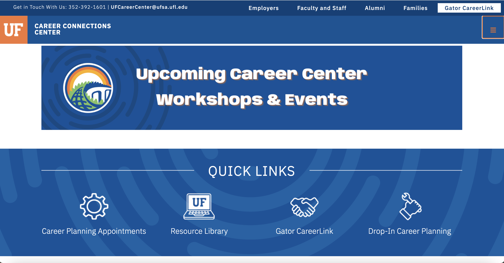
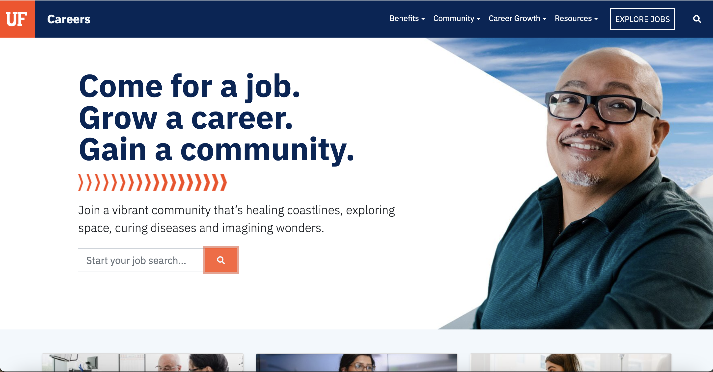

# Strategic Job Search


```{r strategic-opportunity-data, echo=FALSE, message=FALSE, warning=FALSE}
library(readxl)
library(dplyr)
library(scales)
library(htmltools)

bls_data <- read_excel("national_M2024_dl.xlsx")

safe_num <- function(x) {
  x <- as.character(x)
  x[x %in% c("#", "*", "**", "N/A", "NA")] <- NA
  as.numeric(gsub(",", "", x))
}

bls_clean <- bls_data %>%
  mutate(
    TOT_EMP = safe_num(TOT_EMP),
    JOBS_1000 = safe_num(JOBS_1000),
    A_MEAN = safe_num(A_MEAN),
    A_MEDIAN = safe_num(A_MEDIAN)
  )

opportunity_data <- tibble(
  category = c(
    "Software & Web Development",
    "Data & Analytics",
    "IT Support & Systems",
    "Cybersecurity",
    "Networks & Cloud",
    "Research & Advanced Computing"
  ),
  occ_match = list(
    c("Software Developers", "Software Quality Assurance Analysts and Testers", "Web Developers", "Web and Digital Interface Designers"),
    c("Data Scientists", "Operations Research Analysts", "Database Administrators", "Database Architects", "Computer Systems Analysts"),
    c("Computer User Support Specialists", "Computer Network Support Specialists", "Computer Support Specialists"),
    c("Information Security Analysts"),
    c("Computer Network Architects", "Network and Computer Systems Administrators"),
    c("Computer and Information Research Scientists", "Computer Hardware Engineers")
  )
) %>%
  rowwise() %>%
  mutate(
    total_employment = sum(bls_clean$TOT_EMP[bls_clean$OCC_TITLE %in% occ_match], na.rm = TRUE),
    avg_jobs_1000    = mean(bls_clean$JOBS_1000[bls_clean$OCC_TITLE %in% occ_match], na.rm = TRUE),
    mean_salary      = mean(bls_clean$A_MEAN[bls_clean$OCC_TITLE %in% occ_match], na.rm = TRUE),
    median_salary    = mean(bls_clean$A_MEDIAN[bls_clean$OCC_TITLE %in% occ_match], na.rm = TRUE)
  ) %>%
  ungroup()

rescale01 <- function(x) {
  rng <- range(x, na.rm = TRUE)
  if (diff(rng) == 0) return(rep(0.5, length(x)))
  (x - rng[1]) / diff(rng)
}

opportunity_data <- opportunity_data %>%
  mutate(
    opportunity_score = round(
      100 * (
        0.45 * rescale01(total_employment) +
        0.20 * rescale01(avg_jobs_1000) +
        0.20 * rescale01(mean_salary) +
        0.15 * rescale01(median_salary)
      ), 1
    )
  )

cell_fill <- function(values) {
  scaled <- rescale01(values)
  sapply(scaled, function(v) {
    if (is.na(v)) return('style="background:#f8fafc;color:#0D1B2A;"')
    alpha <- 0.12 + (v * 0.73)
    txt <- ifelse(v > 0.55, "#ffffff", "#0D1B2A")
    sprintf('style="background:rgba(0,194,168,%.3f);color:%s;"', alpha, txt)
  })
}

emp_style    <- cell_fill(opportunity_data$total_employment)
jobs_style   <- cell_fill(opportunity_data$avg_jobs_1000)
mean_style   <- cell_fill(opportunity_data$mean_salary)
median_style <- cell_fill(opportunity_data$median_salary)
score_style  <- cell_fill(opportunity_data$opportunity_score)

opportunity_table_html <- paste0(
  '<div class="htn-heatmap-wrap">',
  '<table class="htn-heatmap-table">',
  '<thead><tr>',
  '<th>Job Family</th>',
  '<th>Total Employment</th>',
  '<th>Mean Salary</th>',
  '<th>Median Salary</th>',
  '</tr></thead><tbody>',
  paste0(
    '<tr>',
    '<td>', opportunity_data$category, '</td>',
    '<td ', emp_style, '>', comma(round(opportunity_data$total_employment)), '</td>',
    '<td ', mean_style, '>$', comma(round(opportunity_data$mean_salary)), '</td>',
    '<td ', median_style, '>$', comma(round(opportunity_data$median_salary)), '</td>',
    '</tr>',
    collapse = ''
  ),
  '</tbody></table></div>'
)
```


```{=html}
<style>
/* -- CHAPTER NAV TABS -- */
.htn-chapter-nav {
  display: flex;
  gap: 0.5rem;
  flex-wrap: wrap;
  justify-content: center;
  margin-top: 3rem;
  padding: 0.35rem;
  background: var(--surface);
  border: 1.5px solid var(--border);
  border-radius: 50px;
  width: fit-content;
  margin-left: auto;
  margin-right: auto;
  box-shadow: var(--shadow-sm);
}
.htn-nav-btn {
  background: none;
  border: none;
  padding: 0.55rem 1.3rem;
  font-family: var(--font-body);
  font-size: 0.88rem;
  font-weight: 700;
  color: var(--text-muted);
  cursor: pointer;
  border-radius: 50px;
  transition: all 0.18s;
  white-space: nowrap;
  letter-spacing: 0.01em;
}
.htn-nav-btn:hover {
  color: var(--navy);
  background: #fff;
  box-shadow: var(--shadow-sm);
}
.htn-nav-btn.active {
  background: var(--navy);
  color: #fff;
  box-shadow: 0 2px 8px rgba(13,27,42,0.18);
}

/* -- PANELS -- */
.htn-panel { display: none; }
.htn-panel.active { display: block; }

.htn-section-intro {
  font-size: 0.95rem;
  color: var(--text-muted);
  margin-bottom: 1.8rem;
}

/* -- TIP BOX -- */
.htn-tip-box {
  background: var(--teal-light);
  border-left: 4px solid var(--teal);
  border-radius: 0 var(--radius-sm) var(--radius-sm) 0;
  padding: 1.1rem 1.4rem;
  font-size: 0.93rem;
  color: var(--text-body);
  line-height: 1.75;
  margin: 1rem 0;
}
.htn-tip-box p { margin: 0; }
.htn-tip-box strong { color: var(--navy); }

/* -- REASON CARDS -- */
.htn-reason-grid {
  display: grid;
  grid-template-columns: repeat(3, 1fr);
  gap: 1rem;
  margin: 1.4rem 0;
}
.htn-reason-card {
  background: var(--white);
  border: 1.5px solid var(--border);
  border-radius: var(--radius);
  padding: 1.3rem;
  box-shadow: var(--shadow-sm);
  transition: box-shadow 0.18s, transform 0.18s;
}
.htn-reason-card:hover {
  box-shadow: var(--shadow-md);
  transform: translateY(-2px);
}
.htn-reason-icon {
  font-size: 1.6rem;
  margin-bottom: 0.6rem;
}
.htn-reason-title {
  font-size: 0.97rem;
  font-weight: 800;
  color: var(--navy);
  margin-bottom: 0.4rem;
}
.htn-reason-desc {
  font-size: 0.83rem;
  color: var(--text-muted);
  line-height: 1.6;
}

/* -- PLATFORM CARDS -- */
.htn-platform-grid {
  display: grid;
  grid-template-columns: repeat(2, 1fr);
  gap: 1rem;
  margin: 1.4rem 0;
}
.htn-platform-card {
  background: var(--white);
  border: 1.5px solid var(--border);
  border-radius: var(--radius);
  padding: 1.4rem;
  box-shadow: var(--shadow-sm);
  transition: box-shadow 0.18s, transform 0.18s;
}
.htn-platform-card:hover {
  box-shadow: var(--shadow-md);
  transform: translateY(-2px);
}
.htn-platform-icon { font-size: 2rem; margin-bottom: 0.6rem; }
.htn-platform-name {
  font-size: 1.05rem;
  font-weight: 800;
  color: var(--navy);
  margin-bottom: 0.5rem;
}
.htn-platform-desc {
  font-size: 0.88rem;
  color: var(--text-muted);
  line-height: 1.65;
  margin-bottom: 1rem;
}
.htn-bullet-list {
  list-style: none;
  padding: 0;
  margin: 0;
  font-size: 0.88rem;
  color: var(--text-body);
  line-height: 1.9;
}
.htn-bullet-list li::before {
  content: "◆ ";
  color: var(--teal);
  font-size: 0.5rem;
  vertical-align: middle;
  margin-right: 0.3rem;
}

/* -- IN-PERSON CARDS -- */
.htn-inperson-grid {
  display: grid;
  grid-template-columns: repeat(3, 1fr);
  gap: 1rem;
  margin: 1.4rem 0;
}
.htn-inperson-card {
  background: var(--white);
  border: 1.5px solid var(--border);
  border-radius: var(--radius);
  padding: 1.3rem;
  box-shadow: var(--shadow-sm);
  transition: box-shadow 0.18s, transform 0.18s;
}
.htn-inperson-card:hover {
  box-shadow: var(--shadow-md);
  transform: translateY(-2px);
}
.htn-inperson-icon { font-size: 1.8rem; margin-bottom: 0.6rem; }
.htn-inperson-title {
  font-size: 1rem;
  font-weight: 800;
  color: var(--navy);
  margin-bottom: 0.4rem;
}
.htn-inperson-desc {
  font-size: 0.83rem;
  color: var(--text-muted);
  line-height: 1.6;
  margin-bottom: 0.8rem;
}

/* -- EMAIL TEMPLATE -- */
.ifu-email-wrap {
  background: var(--white);
  border: 1.5px solid var(--border);
  border-radius: var(--radius);
  box-shadow: var(--shadow-sm);
  overflow: hidden;
  margin: 1.4rem 0;
}
.ifu-email-header {
  background: var(--navy);
  color: #fff;
  padding: 0.9rem 1.4rem;
  font-size: 0.82rem;
  font-weight: 700;
  text-transform: uppercase;
  letter-spacing: 0.1em;
}
.ifu-email-body {
  padding: 1.4rem;
  font-size: 0.93rem;
  color: var(--text-body);
  line-height: 1.85;
  white-space: pre-wrap;
  font-family: var(--font-body);
}
.ifu-email-highlight { color: var(--teal); font-weight: 700; }

/* -- CHECKLIST -- */
.htn-checklist-wrap {
  background: var(--white);
  border: 1.5px solid var(--border);
  border-radius: var(--radius);
  box-shadow: var(--shadow-sm);
  overflow: hidden;
  margin: 1.4rem 0;
}
.htn-checklist-header {
  background: var(--navy);
  color: #fff;
  padding: 0.7rem 1.4rem;
  font-size: 0.78rem;
  font-weight: 700;
  text-transform: uppercase;
  letter-spacing: 0.1em;
}
.htn-checklist-item {
  display: flex;
  align-items: flex-start;
  gap: 1rem;
  padding: 0.95rem 1.4rem;
  border-bottom: 1px solid var(--border);
  cursor: pointer;
  transition: background 0.15s;
}
.htn-checklist-item:last-of-type { border-bottom: none; }
.htn-checklist-item:hover { background: var(--surface); }
.htn-checklist-item.checked { background: #f0fdf4; }
.htn-checklist-item.checked .htn-checklist-text {
  color: var(--text-muted);
  text-decoration: line-through;
}
.htn-checklist-checkbox {
  width: 20px; height: 20px;
  border: 2px solid var(--border);
  border-radius: 5px;
  flex-shrink: 0;
  margin-top: 1px;
  display: flex;
  align-items: center;
  justify-content: center;
  transition: all 0.15s;
  font-size: 0.75rem;
  color: #fff;
}
.htn-checklist-item.checked .htn-checklist-checkbox {
  background: var(--teal);
  border-color: var(--teal);
}
.htn-checklist-text {
  font-size: 0.93rem;
  color: var(--text-body);
  line-height: 1.5;
  transition: color 0.15s;
}
.htn-checklist-footer {
  padding: 0.9rem 1.4rem;
  background: var(--surface);
  border-top: 1.5px solid var(--border);
  display: flex;
  align-items: center;
  gap: 1rem;
}
.htn-progress-bar {
  flex: 1;
  height: 8px;
  background: var(--border);
  border-radius: 50px;
  overflow: hidden;
}
.htn-progress-fill {
  height: 100%;
  background: var(--teal);
  border-radius: 50px;
  transition: width 0.3s ease;
}
.htn-progress-label {
  font-size: 0.82rem;
  font-weight: 700;
  color: var(--text-muted);
  white-space: nowrap;
}
.htn-checklist-reset {
  background: none;
  border: 1.5px solid var(--border);
  border-radius: 50px;
  padding: 0.25rem 0.8rem;
  font-size: 0.78rem;
  font-weight: 600;
  color: var(--text-muted);
  cursor: pointer;
  transition: all 0.15s;
}
/*-------OPPORTUNITY HEATMAP----*/
.htn-heatmap-wrap{
  overflow-x: auto;
  border-radius: var(--radius);
  box-shadow: var(--shadow-sm);
  border: 1.5px solid var(--border);
  margin: 1.4rem 0;
}
.htn-heatmap-table {
  width: 100%;
  border-collapse: collapse;
  font-size: 0.86rem;
  background: var(--white);
}
.htn-heatmap-table thead tr {
  background: var(--navy);
  color: #fff;
}
.htn-heatmap-table th {
  padding: 0.85rem 0.95rem;
  font-size: 0.76rem;
  font-weight: 700;
  text-transform: uppercase;
  letter-spacing: 0.06em;
  text-align: center;
  white-space: nowrap;
}
.htn-heatmap-table th:first-child {
  text-align: left;
}
.htn-heatmap-table td {
  padding: 0.8rem 0.95rem;
  text-align: center;
  border-bottom: 1px solid var(--border);
  font-weight: 600;
}
.htn-heatmap-table td:first-child {
  text-align: left;
  font-weight: 700;
  color: var(--navy);
  background: var(--surface);
}
.htn-heatmap-table tbody tr:last-child td {
  border-bottom: none;
}
.htn-heatmap-note {
  font-size: 0.82rem;
  color: var(--text-muted);
  margin-top: 0.8rem;
  line-height: 1.7;
}
.htn-uf-visuals{
  display: flex;
  gap: 1rem;
  margin-top:1rem;
  flex-wrap: wrap;
}
.htn-uf-image-card{
  flex: 1;
  min-width: 260px;
  background: white;
  border-radius: 10px;
  overflow: hidden;
  box-shadow: 0 6px 14px rgba(0,0,0,0.08);
  text-align: center;
}

.htn-uf-image-card img{
  width: 100%;
  height: auto;
  display: block;
}

.htn-uf-caption{
  font-size: 0.8rem;
  color: var(--navy);
  padding: 0.5rem;
  font-weight: 600;
}

.htn-uf-links{
  margin-top: 0.6rem;
  font-size: 0.85rem;
  text-align: center;
}
.htn-checklist-reset:hover { border-color: var(--teal); color: var(--teal); }
</style>

<!-- Chapter Navigation -->
<div class="htn-chapter-nav htn-nav">
  <button class="htn-nav-btn active" onclick="htnShowPanel('htn-overview', this)">Overview</button>
  <button class="htn-nav-btn" onclick="htnShowPanel('htn-why', this)">Why Strategy</button>
  <button class="htn-nav-btn" onclick="htnShowPanel('htn-online', this)">Finding Jobs</button>
  <button class="htn-nav-btn" onclick="htnShowPanel('htn-opportunity', this)">Opportunity Data</button>
  <button class="htn-nav-btn" onclick="htnShowPanel('htn-inperson', this)">Applying Strategically</button>
  <button class="htn-nav-btn" onclick="htnShowPanel('htn-checklist', this)">Checklist</button>
</div>

<!-- PANEL 0: OVERVIEW -->
<div id="htn-overview" class="htn-panel active">
  <h2 style="margin-top:0;">Chapter Overview</h2>

  <div style="background:var(--white);border:1.5px solid var(--border);border-radius:var(--radius);padding:2rem 2.4rem;margin-bottom:1.8rem;box-shadow:var(--shadow-md);">
    <div style="font-size:0.7rem;font-weight:700;letter-spacing:0.18em;text-transform:uppercase;color:var(--teal);margin-bottom:0.6rem;">Chapter Overview</div>
    <div style="font-size:1rem;color:var(--text-body);line-height:1.7;max-width:640px;">This chapter shows you how to approach the job search process strategically instead of randomly applying. Here, you will learn how to search for openings that fit you best, find opportunities efficiently, focus your efforts, and build a system that increases your chances of getting hired. </div>
  </div>

  <div style="display:grid;grid-template-columns:1fr 1fr;gap:1.2rem;margin-bottom:1.8rem;">
    <div style="background:var(--white);border:1.5px solid var(--border);border-radius:var(--radius);padding:1.4rem;box-shadow:var(--shadow-sm);">
      <div style="font-size:0.72rem;font-weight:700;text-transform:uppercase;letter-spacing:0.1em;color:var(--teal);margin-bottom:0.7rem;">What You Will Learn</div>
      <ul style="list-style:none;padding:0;margin:0;font-size:0.93rem;color:var(--text-body);line-height:2;">
        <li>&#10003;&nbsp; Why applying to more jobs is not always better</li>
        <li>&#10003;&nbsp; Where to actually find strong job opportunities</li>
        <li>&#10003;&nbsp; How to apply in a focused and efficient way</li>
        <li>&#10003;&nbsp; How to build a weekly system to stay consistent</li>
      </ul>
    </div>
    <div style="background:var(--white);border:1.5px solid var(--border);border-radius:var(--radius);padding:1.4rem;box-shadow:var(--shadow-sm);">
      <div style="font-size:0.72rem;font-weight:700;text-transform:uppercase;letter-spacing:0.1em;color:var(--teal);margin-bottom:0.7rem;">What Is Inside</div>
      <ul style="list-style:none;padding:0;margin:0;font-size:0.93rem;color:var(--text-body);line-height:2;">
        <li>&#9656;&nbsp; <strong>Why Strategy</strong> — Why most job searches fail</li>
        <li>&#9656;&nbsp; <strong>Finding Jobs</strong> — Where to look for opportunities</li>
        <li>&#9656;&nbsp; <strong>Applying Strategically</strong> — How to focus your efforts</li>
        <li>&#9656;&nbsp; <strong>Checklist</strong> — Stay consistent and on track</li>
      </ul>
    </div>
  </div>
  
  <div class="htn-tip-box">
    <p><strong>How to use this chapter:</strong> Start with Why Strategy to understand what makes searching for a job effective. Then move into Finding Jobs and Applying Strategically. Use the checklist each week to stay consistent and prepared.</p>
  </div>
</div>

<!-- PANEL 1: WHY -->
<div id="htn-why" class="htn-panel">
  <h2 style="margin-top:0;">Why Strategy Matters</h2>
  <p class="htn-section-intro">Many students approach the job search by applying to as many jobs as possible. While this may feel productive and resourceful, it is often inefficient and leads to low response rates. Using a strategic approach focuses your time and energy on the right opportunities. </p>

  <div class="htn-reason-grid">
    <div class="htn-reason-card">
      <div class="htn-reason-icon">🎯</div>
      <div class="htn-reason-title">Quality Over Quantity</div>
      <div class="htn-reason-desc">Targeted applications that align with your goals and skills are more likely to get responses than submitting hundreds of generic applications.</div>
    </div>
    <div class="htn-reason-card">
      <div class="htn-reason-icon">⏳</div>
      <div class="htn-reason-title">Save Time and Energy</div>
      <div class="htn-reason-desc">Applying a structured approach helps you avoid burnout by focusing solely on roles that are realistic and relevant for your background. </div>
    </div>
    <div class="htn-reason-card">
      <div class="htn-reason-icon">📈</div>
      <div class="htn-reason-title">Increase Response Rates</div>
      <div class="htn-reason-desc">Employers are more likely to respond when your application clearly matches the role, making each submission that much more effective.</div>
    </div>
    <div class="htn-reason-card">
      <div class="htn-reason-icon">🧠</div>
      <div class="htn-reason-title">Make Better Decisions</div>
      <div class="htn-reason-desc">Taking a strategic approach allows you to choose opportunities that align with your long-term goals instead of applying mindlessly and blindly.</div>
    </div>
    <div class="htn-reason-card">
      <div class="htn-reason-icon">🤩</div>
      <div class="htn-reason-title">Stand Out in a Competitive Market</div>
      <div class="htn-reason-desc">Many applicants have similar qualifications and experiences. A focused approach helps differentiate you through preparation and alignment.</div>
    </div>
    <div class="htn-reason-card">
      <div class="htn-reason-icon">📊</div>
      <div class="htn-reason-title">Use Data to Guide You</div>
      <div class="htn-reason-desc">Understanding which roles and industries are growing helps you make smarter decisions about where and when to apply.</div>
    </div>
  </div>

  <div class="htn-tip-box">
    <p><strong>Be Intentional.</strong> A smaller number of well-prepared applications is often more effective than applying to hundreds of roles without a clear strategy.</p>
  </div>
</div>


<!-- PANEL 2: FINDING JOBS -->
<div id="htn-online" class="htn-panel">
  <h2 style="margin-top:0;">Finding Jobs</h2>
  <p class="htn-section-intro">Finding the right opportunities is just as important as the application process. Instead of just relying on one source, use multiple outlets to increase your chances of discovering strong roles.</p>

  <div class="htn-platform-grid">
    <div class="htn-platform-card">
      <div class="htn-platform-icon">💼</div>
      <div class="htn-platform-name">LinkedIn</div>
      <div class="htn-platform-desc">LinkedIn is one of the most effective platforms for finding jobs and connecting with recruiters. </div>
      <p style="font-size:0.82rem;font-weight:700;text-transform:uppercase;letter-spacing:0.08em;color:var(--teal);margin-bottom:0.4rem;">Utilize LinkedIn for:</p>
      <ul class="htn-bullet-list">
        <li>Using job alerts to stay updated</li>
        <li>Following companies you are interested in</li>
        <li>Posting and promoting your projects, skills, and certifications</li>
        <li>Applying early when new jobs are posted</li>
      </ul>
    </div>
    
    <div class="htn-platform-card">
      <div class="htn-platform-icon">📄</div>
      <div class="htn-platform-name">Indeed & Job Boards</div>
      <div class="htn-platform-desc">Job boards allow you to explore a variety of opportunities across industries. Indeed offers a centralized platform that makes it easier and more efficient to explore opportunities in depth. </div>
      <ul class="htn-bullet-list">
        <li>Use filters to narrow your search</li>
        <li>Search for entry-level roles specifically</li>
        <li>Save jobs to review later</li>
      </ul>
    </div>
    
    <div class="htn-platform-card">
      <div class="htn-platform-icon">🏢</div>
      <div class="htn-platform-name">Company Websites</div>
      <div class="htn-platform-desc">Applying directly through company websites can sometimes give you an advantage.</div>
      <ul class="htn-bullet-list">
        <li>Check career pages regularly</li>
        <li>Research company roles and values</li>
        <li>Apply directly when possible</li>
      </ul>
    </div>
    
    <div class="htn-platform-card">
      <div class="htn-platform-icon">🔒</div>
      <div class="htn-platform-name">Referrals & Connections</div>
      <div class="htn-platform-desc">Connections can lead to opportunities that are not publicly posted. Having a connection can expand your access to a wider range of openings. </div>
      <ul class="htn-bullet-list">
        <li>Ask connections about open roles</li>
        <li>Leverage alumni networks</li>
        <li>Follow up on referrals</li>
      </ul>
    </div>
  </div>
  
  <h3 style="font-family:var(--font-display);color:var(--navy);font-size:1.2rem;margin-top:1.6rem;">Use Your University Resources</h3>
  
  <p class="htn-section-intro">
  One of the smartest and most overlooked job search strategies is fully using the career resources available through your university. Many schools offer free advising, tools, events, and job boards that are built specifically to help students and recent graduates prepare professional materials, explore careers, and connect with advisors and employers. 
  </p>
  
  <div class="htn-platform-grid">
    <div class="htn-platform-card">
      <div class="htn-platform-icon">🎓</div>
      <div class="htn-platform-name">Career Centers</div>
      <div class="htn-platform-desc">
      University career centers often provide direct support that can make your job search more focused and effective.
      </div>
      <ul class="htn-bullet-list">
      <li>Career counseling, advising, and career exploration</li>
      <li>Resume reviews and mock interviews</li>
      <li>Professional development workshops</li>
      <li>Career fairs and employer networking events</li>
    </ul>
  </div>
  
    <div class="htn-platform-card">
      <div class="htn-platform-icon">💻</div>
      <div class="htn-platform-name">Campus Job Boards and Portals</div>
      <div class="htn-platform-desc">
      Many universities also provide exclusive job platforms where students can apply directly to opportunities at that establishment.
      </div>
      <ul class="htn-bullet-list">
      <li>Internships and entry-level jobs</li>
      <li>On-campus employment opportunities</li>
      <li>Industry events and recruiting sessions</li>
      <li>School specific employer connections</li>
    </ul>
  </div>
  </div>
  
  <div class="htn-tip-box">
   <p><strong>Example:</strong> At the University of Florida, students can use the Career Connections Center for career planning, drop in support, assessments like CHOMP, interview preparation, and career fairs. UF students and alumni can also use Gator CareerLink, a free portal with internships, part-time and full-time jobs, employer recruiting, and career events. Students are also able to explore university employment opportunities through UF job resources. Utilizing these campus resources early in your career can make the job search much more strategic </p>
</div>   

<div class="htn-uf-visuals">
  <div class="htn-uf-image-card">
    <a href="https://career.ufl.edu/" target="_blank">
      
    </a>
    <p class="htn-uf-caption">Career Connections Center</p>
  </div>
  
  <div class="htn-uf-image-card">
    <a href="https://jobs.ufl.edu/" target="_blank">
      
    </a>
    <p class="htn-uf-caption">Jobs at UF Portal</p>
  </div>
  
  </div>
  
  <p class="htn-uf-links">
    Explore these resources:
    <a href="https://career.ufl.edu/" target="_blank">Career Connections Center</a> | <a href="https://jobs.ufl.edu/" target="_blank">Jobs at UF</a>
  </p>

  <div class="htn-tip-box">
    <p><strong>Do not rely on just one platform.</strong> The best opportunities often come from using multiple sources coupled together.</p>
  </div>
  
  
</div>

<!-- PANEL 3: Opportunity Data -->
<div id="htn-opportunity" class="htn-panel">
  <h2 style="margin-top:0;">Opportunity Data</h2>

  <p class="htn-section-intro">
    Searching strategically also means understanding which tech job families appear to offer the strongest opportunity overall. The table below uses national Occupational Employment and Wage Statistics data to compare employment levels and pay across major tech job families.
  </p>

  <div class="htn-tip-box">
    <p><strong>How to read this:</strong> Cells that are colored darker indicate stronger values in that category. Higher employment can suggest more openings overall, while higher salaries can reflect stronger market value and demand. Together, these measures help highlight which job types/categories may be worth prioritizing in your search.</p>
  </div>

```{r strategic-opportunity-table, echo=FALSE, results='asis'}
cat(opportunity_table_html)
```

  <p class="htn-heatmap-note">
    Here is a tool for students to help visualize. This view uses national BLS Occupational Employment and Wage Statistics data rather than state-by-state data, so it is best used to compare job families overall rather than specific locations. It is a strong starting point for deciding which types of roles to prioritize before narrowing your search to specific states.
  </p>
</div>


<!-- PANEL 3: APPLYING -->
<div id="htn-inperson" class="htn-panel">
  <h2 style="margin-top:0;">Applying Strategically</h2>

  <p class="htn-section-intro">
    Once you find opportunities, the next step is applying in a focused and consistent way. Instead of rushing through applications, create a system that helps you stay organized and intentional.
  </p>
  
  <h3 style="font-family:var(--font-display);color:var(--navy);font-size:1.2rem;margin-top:1.5rem;">Weekly Job Search Plan</h3>
  
  <div style="display:grid;grid-template-columns:repeat(4,1fr);gap:1rem;margin:1rem 0 1.6rem;">
  <div class="htn-inperson-card">
    <div class="htn-inperson-icon">📌</div>
    <div class="htn-inperson-title">Find Opportunities</div>
    <div class="htn-inperson-desc">Identify 5-10 roles that match your skills and interests.</div>
  </div>
  
  <div class="htn-inperson-card">
    <div class="htn-inperson-icon">📝</div>
    <div class="htn-inperson-title">Applying Thoughtfully</div>
    <div class="htn-inperson-desc">Submit at least 3-5 strong, well-prepared applications.</div>
  </div>
  
  <div class="htn-inperson-card">
    <div class="htn-inperson-icon">💬</div>
    <div class="htn-inperson-title">Follow Up</div>
    <div class="htn-inperson-desc">Follow up on previous applications and connections.</div>
  </div>
  
  <div class="htn-inperson-card">
    <div class="htn-inperson-icon">📖</div>
    <div class="htn-inperson-title">Improve Skills</div>
    <div class="htn-inperson-desc">Spend time improving a skill relevant to your target roles.</div>
  </div>
</div>
  
  <div class="htn-tip-box">
    <p><strong>Consistency beats intensity.</strong> An intentional, repeatable weekly routine is more effective than occasional spurts of effort.</p>
  </div>
</div>

<!-- PANEL 4: CHECKLIST -->
<div id="htn-checklist" class="htn-panel">
  <h2 style="margin-top:0;">Strategic Job Checklist</h2>

  <p class="htn-section-intro">
    Use this checklist to stay consistent and track your progress throughout your job search process.
  </p>
  
  <div class="htn-checklist-wrap" id="htnChecklist">
  
    <div class="htn-checklist-header">Planning</div>
    <div class="htn-checklist-item" onclick="htnToggleCheck(this)">
      <div class="htn-checklist-checkbox"></div>
      <div class="htn-checklist-text">Identify target roles that align most closely with your skills and goals.</div>
    </div>
    
    <div class="htn-checklist-header">Applying</div>
    <div class="htn-checklist-item" onclick="htnToggleCheck(this)">
      <div class="htn-checklist-checkbox"></div>
      <div class="htn-checklist-text">Apply to 3-5 roles with strong, focused applications.</div>
    </div>
    
    <div class="htn-checklist-header">Tracking</div>
    <div class="htn-checklist-item" onclick="htnToggleCheck(this)">
      <div class="htn-checklist-checkbox"></div>
      <div class="htn-checklist-text">Review and track the status of your applications.</div>
    </div>
    
    <div class="htn-checklist-header">Ongoing</div>
    <div class="htn-checklist-item" onclick="htnToggleCheck(this)">
      <div class="htn-checklist-checkbox"></div>
      <div class="htn-checklist-text">Set aside time each week to continue your job search routine.</div>
    </div>
    
    <div class="htn-checklist-footer">
      <div class="htn-progress-bar">
        <div class="htn-progress-fill" id="htnChecklistFill" style="width:0%"></div>
      </div>
      <div class="htn-progress-label" id="htnChecklistLabel">0 of 4 complete</div>
      <button class="htn-checklist-reset" onclick="htnResetChecklist()">Reset</button>
    </div>
  </div>
</div>

<script>
/* -- PANEL SWITCHING -- */
function htnShowPanel(id, btn) {
  document.querySelectorAll('.htn-panel').forEach(p => p.classList.remove('active'));
  document.querySelectorAll('.htn-nav-btn').forEach(b => b.classList.remove('active'));
  document.getElementById(id).classList.add('active');
  if (btn) btn.classList.add('active');
  window.scrollTo({ top: document.querySelector('.htn-nav').getBoundingClientRect().top + window.scrollY - 20, behavior: 'smooth' });
}

/* -- TOC SIDEBAR LINK INTERCEPTION -- */
const htnAnchorMap = {
  'htn-overview':   'htn-overview',
  'htn-why':        'htn-why',
  'htn-online':     'htn-online',
  'htn-opportunity':'htn-opportunity',
  'htn-inperson':   'htn-inperson',
  'htn-checklist':  'htn-checklist',
};

function htnActivatePanel(targetId) {
  document.querySelectorAll('.htn-panel').forEach(p => p.classList.remove('active'));
  document.querySelectorAll('.htn-nav-btn').forEach(b => b.classList.remove('active'));
  const panel = document.getElementById(targetId);
  if (panel) panel.classList.add('active');
  const btn = document.querySelector(`.htn-nav-btn[onclick*="${targetId}"]`);
  if (btn) btn.classList.add('active');
  const nav = document.querySelector('.htn-nav');
  if (nav) nav.scrollIntoView({ behavior: 'smooth', block: 'start' });
}

function htnInterceptTOCLinks() {
  document.querySelectorAll('a[href*="#"]').forEach(link => {
    const hash = (link.getAttribute('href') || '').replace(/^.*#/, '');
    if (htnAnchorMap[hash]) {
      link.addEventListener('click', function(e) {
        e.preventDefault();
        htnActivatePanel(htnAnchorMap[hash]);
      });
    }
  });
}

document.addEventListener('DOMContentLoaded', function() {
  htnInterceptTOCLinks();
  setTimeout(htnInterceptTOCLinks, 400);
  setTimeout(htnInterceptTOCLinks, 1200);
  setTimeout(htnInterceptTOCLinks, 2500);
  setTimeout(htnInterceptTOCLinks, 5000);
  const hash = window.location.hash.replace('#', '');
  if (htnAnchorMap[hash]) htnActivatePanel(htnAnchorMap[hash]);
});

window.addEventListener('hashchange', function() {
  const hash = window.location.hash.replace('#', '');
  if (htnAnchorMap[hash]) htnActivatePanel(htnAnchorMap[hash]);
});

/* -- CHECKLIST -- */
function htnToggleCheck(item) {
  item.classList.toggle('checked');
  item.querySelector('.htn-checklist-checkbox').innerHTML =
    item.classList.contains('checked') ? '✓' : '';
  htnUpdateProgress();
}

function htnUpdateProgress() {
  const items   = document.querySelectorAll('#htnChecklist .htn-checklist-item');
  const checked = document.querySelectorAll('#htnChecklist .htn-checklist-item.checked');
  const total   = items.length;
  const done    = checked.length;
  const pct     = total > 0 ? (done / total * 100).toFixed(0) : 0;
  document.getElementById('htnChecklistFill').style.width  = pct + '%';
  document.getElementById('htnChecklistLabel').textContent = done + ' of ' + total + ' complete';
}

function htnResetChecklist() {
  document.querySelectorAll('#htnChecklist .htn-checklist-item').forEach(item => {
    item.classList.remove('checked');
    item.querySelector('.htn-checklist-checkbox').innerHTML = '';
  });
  htnUpdateProgress();
}
</script>
```